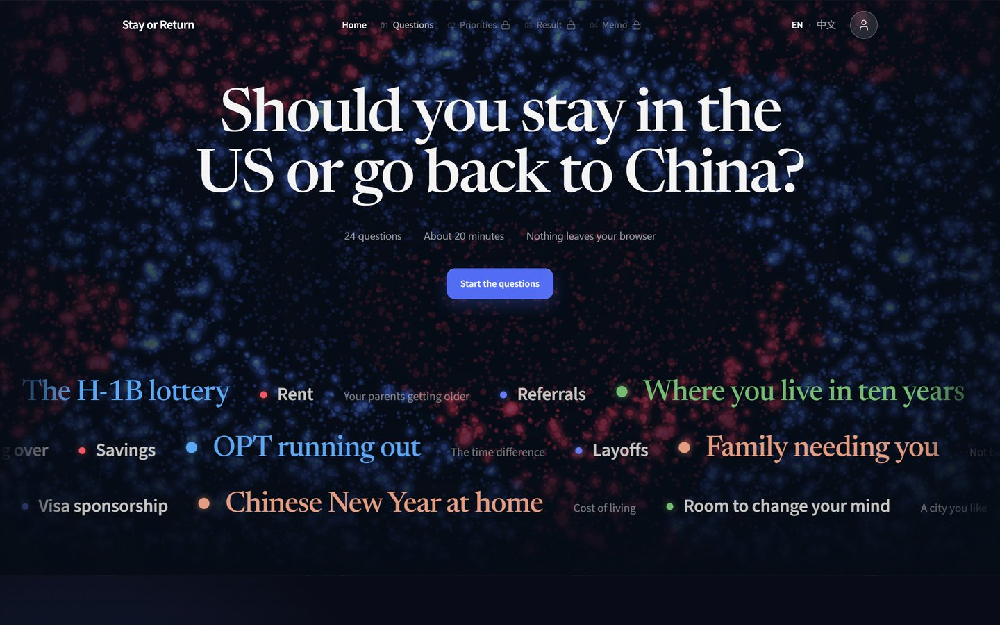
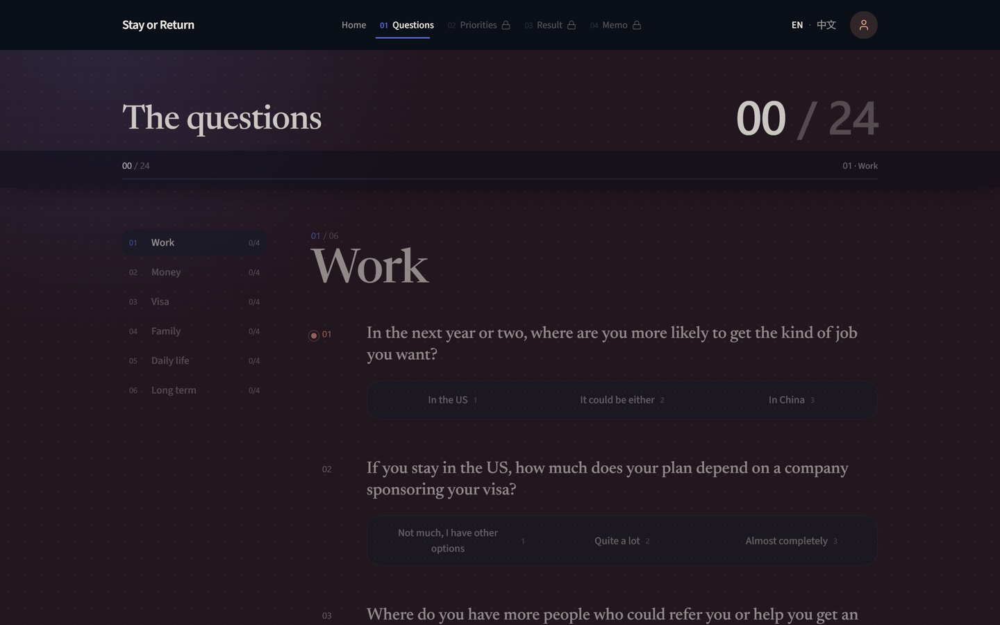
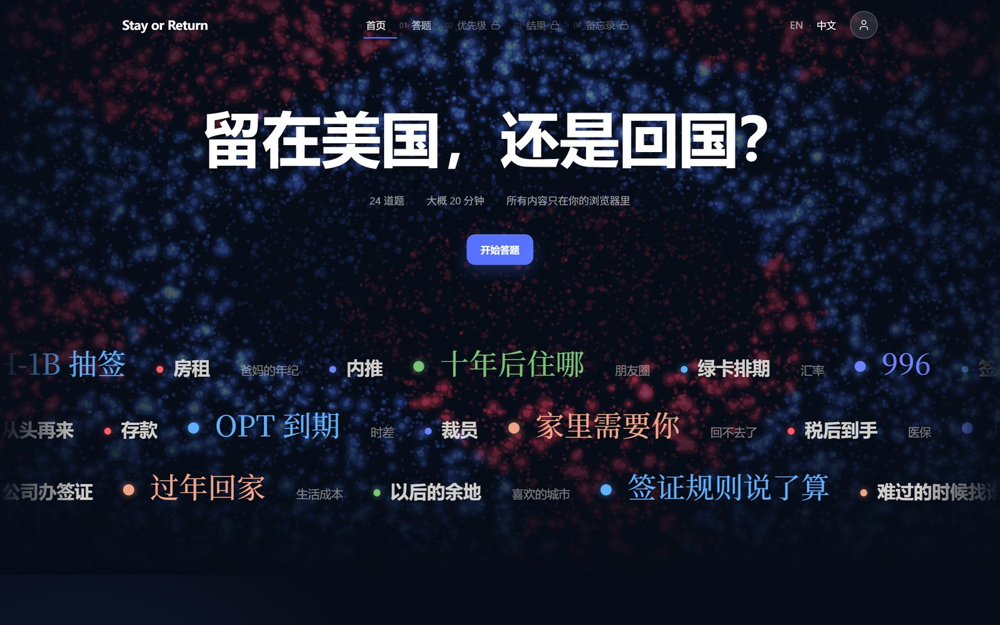

# Stay or Return

**An explainable decision tool for Chinese international students choosing between staying in
the U.S. and returning to China.**

[](https://stayorreturn.com)


Choosing where to build a life is too personal for a black box.  Stay or Return breaks the
decision into **36 questions across six dimensions** — career, salary and cost of living,
immigration and policy uncertainty, family, lifestyle, long-term development — lets users decide
how much each dimension matters, and shows what is pulling them in each direction and how
confident that result really is.  Users leave with a decision memo, not a verdict.

The whole site is available in English and Simplified Chinese (中文): the switch sits in the
header, and the choice stays on the device with everything else.  The home page opens on a
WebGL field of point sprites moving under typed-array physics, with the worries the
questionnaire actually asks about drifting across it — the H-1B lottery, OPT running out, rent,
family needing you — each one a link into the question it belongs to.

<p align="center">
  
  
</p>
<p align="center">
  
  <br><sub>The same page, switched to Chinese</sub>
</p>

## How it works

1. **Questionnaire** — six steps of four questions each, answered for the user's current
   situation; any step can be revisited.
2. **Weights** — an interactive bubble layout (d3-hierarchy) where the user sets how much each
   dimension matters, with fine-grained controls.
3. **Result** — the quick read: a single **weighted-gap score** on a bipolar stay ↔ return
   scale, a confidence tier (low / medium / high, from how far the gap sits from neutral), the
   dimensions pulling each way, the ones still close, and whether different weights could flip
   the sign.  It stops there; the reasoning belongs to the memo.
4. **Memo** — a print-friendly decision memo written from this run and nothing else: how far
   the answers lean, which dimensions made the lead **and which of the user's own answers those
   were**, what pulls the other way, and what would have to change to flip it.  The sentences
   live in each language's dictionary, one per line; `lib/report.ts` decides which apply and
   hands them the reader's answers to quote (`lib/reasons.ts`).  No template prose.
5. **Profile & history** — a device-local profile (optional nickname) and the last ten results,
   each reopenable as a read-only snapshot or restored as the current run.
6. **Share** — a read-only copy of a result that travels entirely inside the link.

### Why one score instead of two

The first version showed "stay" and "return" as separate scores.  Because the two values were
mathematically complementary, that presentation exaggerated the amount of information in the
result.  The model was rebuilt around one weighted gap,

```
gap = Σ_d  w_d · (score_d(stay) − score_d(return))        w_d ≥ 0,  Σ_d w_d = 1
```

reported together with a confidence tier, the dimensions that dominate the gap, and how much
the close dimensions would have to move to flip the sign.  Every answer moves one balance
between the two paths — strong stay, lean stay, balanced, lean return, strong return — and the
interface shows exactly that, once, instead of two mirror-image numbers.

## The look

One surface per page and nothing framed inside it.  Sections are separated by hairlines and by
bands of tone rather than by cards, headings sit offset against the text they introduce, and the
page rises into place on arrival instead of fading.  Two shadow levels exist: a 1 px lift for
things that sit on the page, and a soft one for the bar that sticks while scrolling — a raised
element gets a hairline of light along its top edge, never a grey drop shadow.

Headings are set in **Newsreader** at reading size with no capitals, running text in **Source
Sans 3**, Chinese in the system serif with **Noto Serif SC** behind it.  Every number — the
score, the counters, `00 / 36` — is tabular, so nothing shifts as it counts up.  The result
reveal is the one piece of choreography: the bars grow and the balance marker settles with a
small overshoot (`--motion-duration-reveal`, 650 ms), and it respects reduced motion.

## Privacy by design

| | |
|---|---|
| No accounts | Profiles and a ten-result history live in the browser only, behind `lib/storage.ts` — no profile, answer or result ever leaves the device |
| Private sharing | Shared results are encoded in the URL **fragment**, which browsers never send to any server — the site cannot see what was shared (`lib/share.ts`) |
| Minimal analytics | The only server surface, `app/api/stats`, keeps coarse anonymous counters by direction and confidence tier in Upstash Redis — no ids, no IPs, no answers, no timestamps finer than a month.  One atomic script per completion; rate-limit keys are HMAC-hashed and expire on their own (a 2-minute per-IP burst window, a 48-hour daily window — `lib/server/rate-limit.ts`) |
| Owner-only view | Aggregate stats are readable only with a Bearer token; every other request to that endpoint answers 404 |
| Export / delete | Users can export everything the device knows as JSON, or erase profile and history, at any time |

## Project structure

```
app/            App Router pages: /, /questionnaire, /weights, /results, /report, /profile,
                /profile/run (history snapshot), /shared (read-only shared result), /api/stats
components/     UI by page (home, questionnaire, weights, results, report, profile, share)
                + layout/ (nav, profile chip) + shared ui/
                home/decision-map-canvas.tsx is the WebGL hero field
data/           dimensions.ts, questions.ts (36 items), and their Chinese copy (*.zh.ts)
lib/            scoring.ts (weighted-gap model), report.ts + reasons.ts (the memo, quoting
                the reader's answers), run-state.ts (one source of truth for the current run),
                guards.ts, share.ts (link codec), routes.ts, stats-schema.ts, stats-client.ts
lib/i18n/       en.ts, zh.ts, content.ts, provider.tsx — every sentence the site can say
lib/storage/    every localStorage access, split by concern (current-run, history, profile,
                locale, data-export, stats-marker) behind the lib/storage.ts barrel
lib/server/     stats-store.ts (Upstash REST, no SDK), stats-keys.ts, rate-limit.ts, env.ts
middleware.ts   sends damaged links — stray punctuation, capitals, invisible characters, an
                emoji, a folded fragment, an address pasted into itself — to the page they meant
public/         two short city videos further down the home page, and their posters
types/          shared TypeScript types
docs/           screenshots used in this README
.agents/        AGENTS.md — the engineering rules every change follows
```

## Run locally

```bash
pnpm install
pnpm dev          # http://localhost:3000
pnpm typecheck
pnpm build && pnpm start
```

Everything a user touches — questionnaire, weights, results, memo, profile, history, sharing —
runs entirely in the browser with no configuration.

The aggregate statistics endpoint is optional.  Copy `.env.example` to `.env.local` and fill in
the Upstash Redis REST credentials (the Vercel Marketplace "Upstash for Redis" integration injects
them as `KV_REST_API_URL` / `KV_REST_API_TOKEN`), a `STATS_ADMIN_TOKEN` for the owner view, and
ideally a `STATS_RATE_SALT`.  Without them the endpoint accepts events and stores nothing.

```bash
curl -H "Authorization: Bearer $STATS_ADMIN_TOKEN" https://stayorreturn.com/api/stats
```

## Built with

Next.js 15.5 · React 19 · TypeScript · Tailwind CSS · WebGL (hero field) · d3-hierarchy
(weights) · lucide-react · Newsreader + Source Sans 3, Noto Serif SC for Chinese · Upstash Redis
(via Vercel Marketplace) · Vercel

Designed and developed independently from product definition through deployment, with team
collaboration on promotion.
