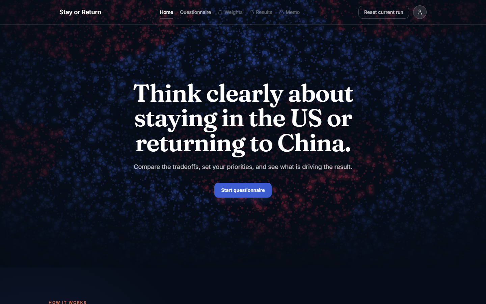
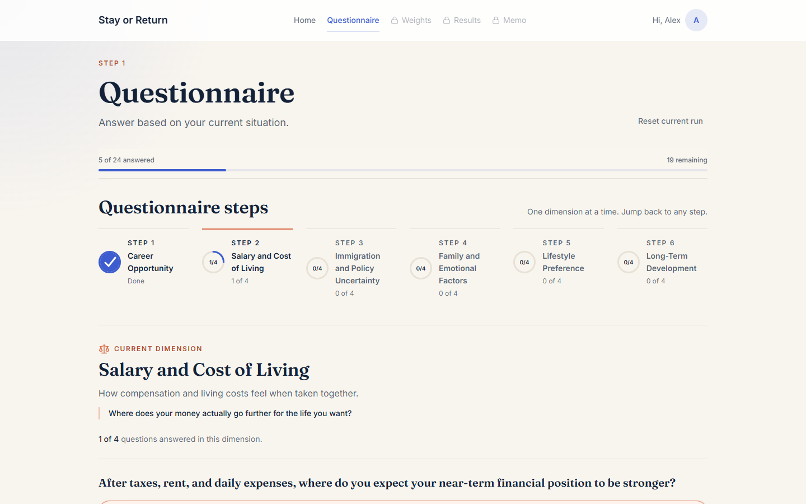
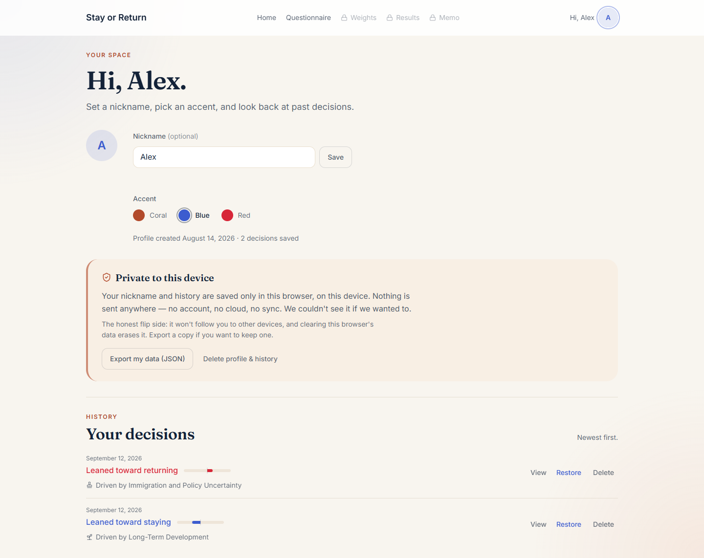

# Stay or Return

**An explainable decision tool for Chinese international students choosing between staying in
the U.S. and returning to China.**

[](https://stayorreturn.com)


Choosing where to build a life is too personal for a black box.  Stay or Return breaks the
decision into **24 questions across six dimensions** — career, salary and cost of living,
immigration and policy uncertainty, family, lifestyle, long-term development — lets users decide
how much each dimension matters, and shows what is pulling them in each direction and how
confident that result really is.  Users leave with a decision memo, not a verdict.

<p align="center">
  
  
</p>

## How it works

1. **Questionnaire** — six steps of four questions each, answered for the user's current
   situation; any step can be revisited.
2. **Weights** — an interactive bubble layout (d3-hierarchy) where the user sets how much each
   dimension matters, with fine-grained controls.
3. **Results** — a single **weighted-gap score** on a bipolar stay ↔ return scale, a confidence
   tier (low / medium / high, from how far the gap sits from neutral), the key drivers, the
   dimensions that are still close, and a sensitivity check of whether different weights could
   flip the result.
4. **Memo** — a print-friendly decision memo: recommendation, why not the other path, one lean
   per dimension, risks, and next steps.
5. **Profile & history** — a device-local profile (optional nickname) and the last ten results,
   each reopenable as a read-only snapshot or restored as the current run.
6. **Share** — a read-only copy of a result that travels entirely inside the link.

### Why one score instead of two

The first version showed "stay" and "return" as separate scores.  Because the two values were
mathematically complementary, that presentation exaggerated the amount of information in the
result.  The model was rebuilt around one weighted gap,

```
gap = Σ_d  w_d · (score_d(stay) − score_d(return))        w_d ≥ 0,  Σ_d w_d = 1
```

reported together with a confidence tier, the dimensions that dominate the gap, and how much
the close dimensions would have to move to flip the sign.  Every answer moves one balance
between the two paths — strong stay, lean stay, balanced, lean return, strong return — and the
interface shows exactly that, once, instead of two mirror-image numbers.

## Privacy by design

| | |
|---|---|
| No accounts | Profiles and a ten-result history live in the browser only, behind `lib/storage.ts` — no profile, answer or result ever leaves the device |
| Private sharing | Shared results are encoded in the URL **fragment**, which browsers never send to any server — the site cannot see what was shared (`lib/share.ts`) |
| Minimal analytics | The only server surface, `app/api/stats`, keeps coarse anonymous counters by direction and confidence tier in Upstash Redis — no ids, no IPs, no answers, no timestamps finer than a month.  One atomic script per completion; rate-limit keys are HMAC-hashed and expire on their own (a 2-minute per-IP burst window, a 48-hour daily window — `lib/server/rate-limit.ts`) |
| Owner-only view | Aggregate stats are readable only with a Bearer token; every other request to that endpoint answers 404 |
| Export / delete | Users can export everything the device knows as JSON, or erase profile and history, at any time |

<p align="center">
  
</p>

## Project structure

```
app/            App Router pages: /, /questionnaire, /weights, /results, /report, /profile,
                /profile/run (history snapshot), /shared (read-only shared result), /api/stats
components/     UI by page (home, questionnaire, weights, results, report, profile, share)
                + layout/ (nav, profile chip) + shared ui/
data/           dimensions.ts, questions.ts (24 items), report-templates.ts
lib/            scoring.ts (weighted-gap model), report.ts, storage.ts (all localStorage),
                guards.ts, share.ts (link codec), stats-schema.ts, stats-client.ts
lib/server/     stats-store.ts (Upstash REST, no SDK), stats-keys.ts, rate-limit.ts, env.ts
public/         hero videos (compressed from 56.4 MB to 2.6 MB, lazy-loaded) and posters
types/          shared TypeScript types
docs/           screenshots used in this README
.agents/        AGENTS.md — the engineering rules every change follows
```

## Run locally

```bash
pnpm install
pnpm dev          # http://localhost:3000
pnpm typecheck
pnpm build && pnpm start
```

Everything a user touches — questionnaire, weights, results, memo, profile, history, sharing —
runs entirely in the browser with no configuration.

The aggregate statistics endpoint is optional.  Copy `.env.example` to `.env.local` and fill in
the Upstash Redis REST credentials (the Vercel Marketplace "Upstash for Redis" integration injects
them as `KV_REST_API_URL` / `KV_REST_API_TOKEN`), a `STATS_ADMIN_TOKEN` for the owner view, and
ideally a `STATS_RATE_SALT`.  Without them the endpoint accepts events and stores nothing.

```bash
curl -H "Authorization: Bearer $STATS_ADMIN_TOKEN" https://stayorreturn.com/api/stats
```

## Built with

Next.js 15 · React · TypeScript · Tailwind CSS · d3-hierarchy · lucide-react · Upstash Redis
(via Vercel Marketplace) · Vercel

Designed and developed independently from product definition through deployment, with team
collaboration on promotion.
